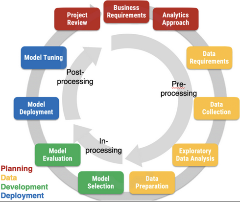

AI fairness in the AI system lifecycle: the holistic AEQUITAS approach
######################################################################

Introduction
************

Fair-by-design Approaches
*************************

Bridging the gap needed: motivation

More details can be found in the following subsections:

* :ref:`Technical Lens<Technical Lens>`
* :ref:`Social, Legal and Ethical Technical Lens`

Social, Legal and Ethical Technical Lens
========================================
There is no such thing as a consolidated sociological method for fair-by-design
AI. The first action is to understand technology through a sociotechnical lens
that sustains the acknowledgment of mutual influences between technical and
social structures. This passage is required to highlight the culture of and
modes of knowledge production in computer science that betrayed the social goals
the field was trying to achieve

We are transitioning from an industrial society to an "Artificial Intelligence
society", driven by two key forces: stratification and association, representing
vertical and horizontal movements. Existing social divisions and inequalities
persist, but new forms are emerging as social structures, economic relations,
and computational systems intersect.  Understanding these contextualized
features of AI is crucial to avoid the *abstraction error* often made in
computer science, which overlooks social context.

* A very relevant notion is that of **situated knowledge** underlying knowledge
  production and the power relations among relevant stakeholders.
* Revealing ML’s social world is key to

Fairness Social Perspective
---------------------------

**Distributive fairness** refers to the fairness of the *outcomes (aims)* of
decision making, while **procedural fairness** refers to the fairness of the
*decision-making processes (means)* that lead to the outcomes. 

Technology is result of a process of social construction with the contribution
of a variety of stakeholders.

::

    Is fairness distributive or procedural? Should it be a socially constructed
    notion?

* **Disparate impact** happens when members of a marginalized class are
  negatively affected more than others when using a formally neutral policy or
  rule. 
    * It is unintentional or indirect discrimination. 
* **Disparate treatment** refers to the situation where an individual is
  intentionally treated differently based on their membership of a marginalized
  class.
* Neither disparate impact nor disparate treatment aim exclusively at
  distributive fairness
    * More sophisticated notions are required → procedural fairness.

Technical Lens
==============

There is a dearth of fair-by-design methodologies tackled from the
engineering/technology perspective. Technological approaches mostly focus on
specific phases of the AI lifecycle (e.g., data collection, training of models,
evaluation of results, etc.). 

AI outside of the ML subfield is extremely underrepresented, and this is
especially true from the technological point of view. This is a limitation:

* There are many AI algorithms that do not fall into the ML categories whose
  impact to society and economy is non-negligible and whose behavior can be
  influenced by various biases. 

* We recommend researchers and practitioners to start increasing their
  attentions to other AI domains as well.

FairBridge: Converting Legal and Social Principles into AI Fairness Techniques
******************************************************************************

* HICCS paper (plus other stuff from D5.3)

AI fairness Methodology
***********************

* building blocks “clickable”
* for each building block link to the guidelines
* Development & Evaluation link to the tech
